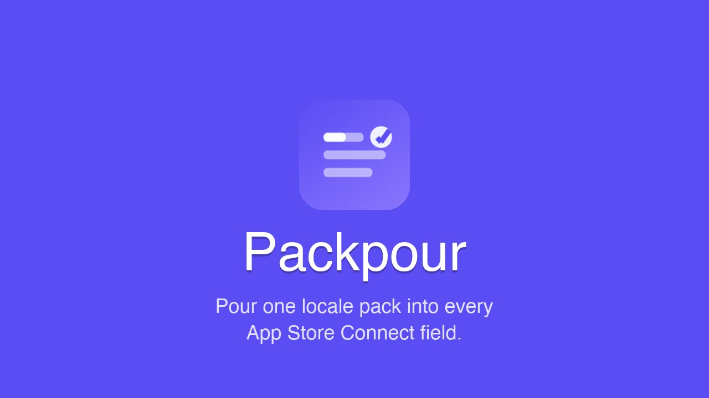

<p align="center">
  
</p>

<h1 align="center">Packpour</h1>

<p align="center">
  <strong>Pour one locale pack into every App Store Connect field.</strong><br>
  The narrow, local-first Chrome side panel for ASO ops — stop hand-pasting metadata, keep Save / Submit manual.
</p>

<p align="center">
  <a href="https://github.com/hooosberg/Packpour/releases/latest">
    
  </a>
  <a href="https://hooosberg.github.io/Packpour/">
    
  </a>
  <a href="https://github.com/hooosberg/Packpour">
    
  </a>
</p>

<p align="center">
  <em>If Packpour saves you time, please ⭐ star this repo — it helps other indie devs and ASO folks discover it.</em>
</p>

<p align="center">
  <a href="./LICENSE">
    
  </a>
  
  
  
  
</p>

<p align="center">
  <strong>
    English &nbsp;|&nbsp;
    <a href="./README.zh-CN.md">简体中文</a> &nbsp;|&nbsp;
    <a href="./README.zh-TW.md">繁體中文</a> &nbsp;|&nbsp;
    <a href="./README.ja.md">日本語</a> &nbsp;|&nbsp;
    <a href="./README.ko.md">한국어</a> &nbsp;|&nbsp;
    <a href="./README.fr.md">Français</a> &nbsp;|&nbsp;
    <a href="./README.de.md">Deutsch</a> &nbsp;|&nbsp;
    <a href="./README.es.md">Español</a> &nbsp;|&nbsp;
    <a href="./README.pt.md">Português</a> &nbsp;|&nbsp;
    <a href="./README.it.md">Italiano</a>
  </strong>
</p>

<p align="center">
  
</p>

---

## About

**Packpour** is a Chrome side panel scoped to `appstoreconnect.apple.com`. You already have AI write solid ASO copy — the bottleneck is moving it into App Store Connect, locale by locale, field by field. Packpour does that narrow step and nothing else.

Drop in a TXT or Markdown metadata pack, pick a locale, click **Pour**. Every labeled block lands in the matching field on the current page. Save and Submit stay manual — because for this workflow, a safe boundary beats "full auto".

## Highlights

### 1. One Pack, Every Field

Import a structured TXT or Markdown file with labeled blocks (`NAME`, `SUBTITLE`, `DESCRIPTION`, `KEYWORDS`, `PROMOTIONAL TEXT`, `SUPPORT URL`, etc.). Packpour pours each value into the matching field on the current App Store Connect locale page in one click.

### 2. Smart Field Matching

Fields are matched by label first, then `placeholder`, `aria-label`, neighboring text, `name`, and `id`. If none match, Packpour falls back to filling the focused field — so even unusual ASC layouts stay workable.

### 3. Safe by Design

Password, payment, token, and secret-looking fields are always skipped. Packpour never clicks **Save**, **Publish**, or **Submit for Review**. Every action stops one step before commit — you review, you submit.

### 4. Local-First

Metadata packs live in Chrome's local storage. Nothing leaves your browser — no analytics, no cloud, no third-party servers. The extension is scoped by manifest to `appstoreconnect.apple.com` only.

### 5. AI-Pack Generator Built In

The in-extension **Help** tab ships a prompt that turns a one-sentence app idea into a complete multi-locale metadata pack, across every App Store language. Paste it to Claude / ChatGPT / Gemini / any model — get a ready-to-pour file back.

### 6. Ten UI Languages

UI strings ship in English, Simplified Chinese, Traditional Chinese, Japanese, Korean, French, German, Spanish, Portuguese, and Italian. Auto-picks your Chrome language; the side panel lets you switch manually.

## How It Works

```
Your AI (Claude / ChatGPT / Gemini / local model)
    ↓  "write me an ASO pack for <app idea>, every locale"
Metadata pack   (TXT or Markdown, one labeled block per field)
    ↓  import into Packpour side panel
App Store Connect locale page   (you open the locale you want to fill)
    ↓  click "Pour"
Fields matched by label / placeholder / aria-label / name / id / focus
    ↓  values written in place · Save / Submit still manual
You review and commit
```

No remote server in the loop. No background sync. Packpour is one click between your pack and the current ASC page.

## Quick Start

1. **Install** — Download the latest `.zip` from [Releases](https://github.com/hooosberg/Packpour/releases/latest), unzip to a stable folder, open `chrome://extensions`, enable **Developer mode**, click **Load unpacked**, pick the unzipped folder. *(Chrome Web Store listing in review.)*
2. **Open App Store Connect** — Navigate to your app's metadata page for the locale you want to fill.
3. **Open Packpour** — Click the Packpour icon to open the side panel, import your TXT / Markdown pack.
4. **Pour** — Select the locale, click **Pour**. Review the filled fields, click **Save** yourself.

## Pack Format

Each locale file uses stable field labels with a value block below each label:

```text
NAME
My App Name

SUBTITLE
Short ASO subtitle

PROMOTIONAL TEXT
Short launch or update copy.

DESCRIPTION
Long App Store description.

KEYWORDS
comma,separated,keywords

SUPPORT URL
https://example.com/support

MARKETING URL
https://example.com

PRIVACY POLICY URL
https://example.com/privacy
```

The in-extension **Help** tab has an AI prompt that generates this exact format from one app idea, across every App Store locale.

## Why Not Just Use X?

| | Manual copy-paste | Full-auto scraper / bot | iTMSTransporter + fastlane | **Packpour** |
|---|---|---|---|---|
| **Setup** | None — just you | Node project, CI, tokens | CLI toolchain, `.itc` creds | Load unpacked, one install |
| **Review before submit** | ✅ | ❌ or weak | ✅ (scripted) | ✅ by design — never auto-submits |
| **Per-locale cost** | Tens of minutes | Low per run, high setup | Medium per release | **~1 minute per locale** |
| **Handles ASC layout changes** | You adapt | Breaks silently | Needs spec update | Field matching degrades gracefully |
| **Credentials needed** | Your ASC login | App-Specific Password / API key | `.itc-transporter-session` | None beyond your browser session |
| **Scope** | Whatever you click | Full App Store Connect surface | Full pipeline | Just the current locale page |
| **Privacy** | Local | Often cloud | Local | **100% local, side panel only** |

**Packpour is narrow on purpose.** If you want full-release automation, use fastlane. If you want quick, safe, per-locale metadata filling while keeping human review, Packpour is for you.

## Repository Layout

```
local/                    Chrome extension source (point "Load unpacked" here)
  manifest.json
  popup.{html,js,css}
  content.js · background.js
  _locales/               Chrome i18n (appName, appDescription per locale)
  icons/                  16 / 32 / 48 / 128 PNG icons

github/
  README.md               this file
  README.*.md             nine translations
  LICENSE                 MIT
  pack-release.sh         build script (reads local/manifest.json)
  releases/               local zip staging (gitignored)
  site/                   GitHub Pages landing page
  .github/workflows/pages.yml
```

## Build a Release

From the project root:

```bash
bash github/pack-release.sh
```

Writes `github/releases/Packpour-v{version}.zip` using the version in `local/manifest.json`. Upload that zip as an asset on a new GitHub release tagged `v{version}`.

## Resources

- **Website**: [hooosberg.github.io/Packpour](https://hooosberg.github.io/Packpour/)
- **Download**: [Latest release](https://github.com/hooosberg/Packpour/releases/latest)
- **Privacy Policy**: [site/privacy.html](./site/privacy.html)
- **Terms of Service**: [site/terms.html](./site/terms.html)

## Contact

- **GitHub**: [hooosberg/Packpour](https://github.com/hooosberg/Packpour)
- **Email**: [zikedece@proton.me](mailto:zikedece@proton.me)

## Sibling projects

Built by [hooosberg](https://github.com/hooosberg):

- [AgentLimb](https://agentlimb.com) — teach AI to control your browser
- [BeRaw](https://hooosberg.github.io/BeRaw/) — Behance raw-image grabber
- [WitNote](https://hooosberg.github.io/WitNote/) — local-first AI writing companion
- [GlotShot](https://hooosberg.github.io/GlotShot/) — perfect App Store preview images
- [TrekReel](https://hooosberg.github.io/TrekReel/) — outdoor trails, cinematic reels
- [DOMPrompter](https://hooosberg.github.io/DOMPrompter/) — visualize DOM for AI code
- [UIXskills](https://uixskills.com) — AI → JSON → Whiteboard → UI

## License

[MIT](./LICENSE) — free for personal and team use. Contributions welcome via pull request.

Not affiliated with Apple. App Store Connect and all Apple trademarks belong to Apple Inc.

Copyright © 2026 hooosberg. All rights reserved.
